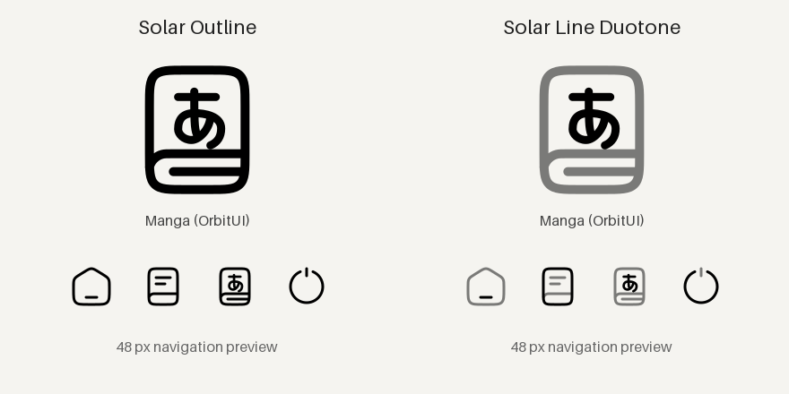

# Per-icon sources

OrbitUI offers Solar Outline, Solar Line Duotone and Tabler as additional
**per-icon sources**, alongside Material Symbols Rounded and the existing
Nerd Font and custom images. These are curated offline selections, not the full
upstream libraries: 80 icons in each Solar style and 75 Tabler icons.
The sources and custom manga icons were introduced in `0.1.0-alpha.10`.
They do not appear under Icon Packs and never replace other icons automatically.

Version `0.1.0-alpha.11` adds **Database**, **Cloud Download**,
**Download Minimalistic** and **Library** in both Solar styles. Search by these
names; Library is under Reading and the other three are under System.

Choose the button/action you want to edit, then **Solar Outline...**,
**Solar Line Duotone...** or **Tabler...**. Search, categories and pagination
work the same way as in the Material picker. Bookshelf's image-capable icon
library also offers all three sources. Existing icon selections are untouched.

**Manga (OrbitUI)** is first in both Solar lists; searching for `manga` finds it.
It combines a softly rounded book with hiragana on the cover, in monochrome and
line-duotone variants. It is a credited adaptation of Solar and Tabler artwork,
not an official icon from either project. Tabler's `language-hiragana` is also
available. The shapes are SVG paths and need no Japanese or icon font.



Solar retains its original outlines/opacity and Tabler its native 2-unit stroke.
These new sources do not use Material's 200/300/400/500 weight scale. In the
combined Bookshelf picker, **Material: 300...** controls only Material previews.
Mix styles freely by selecting each icon individually.

## Material Symbols Rounded

OrbitUI bundles an optional, offline catalogue of 110 Material Symbols Rounded
icons, including `manga` and `comic_bubble`, at weights 200, 300, 400 and 500.
The default weight is 300, as requested by the user. Existing unweighted Material
selections follow this new default; explicitly selected weights remain fixed.
Icon identities, KOReader's Symbols Nerd Font and custom PNG/SVG selections
are not changed.

## Choosing icons

In OrbitUI settings, open **Appearance > Home appearance > Icons**.
Choose a system icon or quick-action icon, then **Material Symbols Rounded...**.
The picker has previews, Reading/Navigation/System/Tools categories and search
(including some Swedish aliases). Manga appears first under Reading.

Material is a source for choosing **one icon at a time**, not an entry under
**Icon Packs**. Opening or cancelling the picker changes nothing. Selecting an
icon changes only the button/action being edited. Other installed icon packs
keep their existing behavior.

Use **Line thickness...** at the bottom of the Material picker to preview
200 (Thin), 300 (Light, default), 400 (Regular) or 500 (Medium). Then tap an icon
to save that icon and its weight. Choosing a thickness alone does not save
anything; cancelling the picker leaves the previous choice intact. Reopening
an existing icon starts at its saved weight, while a new Material choice starts
at 300. This control affects only Material icons, not Nerd Font or custom images.
The per-icon weight control is available in `0.1.0-alpha.9`.

The published alpha.6 still has the whole-pack preset. Do not apply that preset
to browse icons: it immediately overwrites many icon overrides. The per-icon
path above also exists in alpha.6, but use alpha.8 or newer for the corrected SVG
rendering and per-icon picker initialization.
If alpha.6 can no longer start after applying Material, see
[temporary recovery](../recovery/README.md). An already-working alpha.5 can update
directly to alpha.8 without the recovery patch or an intermediate alpha.6 install.

Bookshelf's icon library includes a **Material** category and searchable
Material entries for chip labels, start-menu icons and hero action cards. Its
image-capable picker has the same thickness control and weight previews.
Text-only token templates deliberately do not offer them: these templates
cannot render a different icon font or image token without further changes.

## Integration

`core/orbitui_icons.lua` owns names, paths and cached catalogue/search data.
`core/orbitui_vector_icons.lua` adds three lazy, whitelisted SVG catalogues.
`adapters/orbitui_icons.lua` supplies optional component
hooks through the existing runtime module resolver. No global Font or
IconWidget replacement, fallback-face mutation, or copied icon directory.

- SimpleUI's picker returns a weight-qualified bundled SVG path, for example
  `assets/material-symbols/icons/300/manga.svg`. Named `material:manga:300`
  references resolve through `safeIconPath` too. Material never loads a custom
  font or replaces native image buttons
  with TextWidgets; Nerd-specific APIs and their existing rendering are unchanged.
- Native menu tabs use the SVG and existing registration path. Known packaged
  SVG paths are rebased to the current runtime root on read, including when a
  setting contains a previous OTA-slot path.
- Bookshelf stores `[icon=orbitui-material-manga-w300]`. The start-menu model's
  optional imageIconFile resolver is shared by start-menu, chip and action
  renderers; other user icons continue through native name lookup.
- Legacy unweighted names, tokens and flat SVG paths resolve to weight 300
  without rewriting settings. Explicit weight-qualified choices survive an OTA
  slot change and do not depend on the default. Only known names and weights
  are accepted. No setting or global weight is shared between edited icons.
- The SVGs contain static outlines for all four weights; the static font and
  legacy flat SVG aliases match weight 300. The font remains part of the
  reproducible asset inventory but is not loaded by the UI. Material follows
  the existing SVG, dimming and alpha-mask rendering paths.

Component seams: SimpleUI config, quick-action rendering/picker, style,
titlebar resizing and empty-folder covers; Bookshelf icon-library extra
sources/explicit preview file and three image-token rendering paths. The optional
`configurePicker` hook adds the weight control before modal construction;
the start-menu icon editor passes `current_icon` to restore its saved weight.
These seams are kept small and must be preserved in future imports (C07/C08).
The new sources use these same seams without changing component code. Named
identities such as `solar-outline:manga`, `solar-duotone:manga` and
`tabler:language-hiragana` resolve to current runtime files; Bookshelf tokens
use `[icon=orbitui-solar-outline-manga]`, etc. Absolute packaged paths also
rebase on OTA. Material parsing and weight selection remain independent.

## Rebuilding and verification

The upstream revision, input SHA-256s and selection are pinned in
`assets/material-symbols/selection.json`. Fetch that exact revision's
`variablefont/MaterialSymbolsRounded[FILL,GRAD,opsz,wght].ttf` and `.codepoints`;
then, in a development environment with `fonttools==4.60.1`, run:

```sh
python scripts/build-material-icons.py /path/to/font.ttf /path/to/font.codepoints
```

The script checks the inputs before generating the static subset, SVGs,
Lua catalogue and output checksums. License and modification notices are
included in runtime archives. No generation or network access occurs on the
reader. Run `sh scripts/test.sh` and validate a runtime ZIP before release.

Solar and Tabler revisions/selections are pinned in
`assets/vector-icons/selection.json`. Clone each repository and fetch the pinned
commit, then run (Python 3.9+ standard library only):

```sh
python3 scripts/build-vector-icons.py /path/to/Solar-Icon-Set /path/to/tabler-icons
```

The builder reads Git blobs at the exact pinned revisions, rather than checkout
files or a moving branch. Generated SVGs are restricted to local geometry and
attributes, with explicit black instead of `currentColor`; original opacity is
retained. Input blob IDs/SHA-256s and output checksums live in `generated.json`.
The manga source artwork lives in `assets/vector-icons/custom/`. Edit those
SVGs and regenerate, not the generated copies. CC BY 4.0, MIT and modification
notices are bundled alongside the assets. Solar's CC license text comes from
`https://creativecommons.org/licenses/by/4.0/legalcode.txt`.

For the optional preview, install `cairosvg` and `Pillow` in a development venv:

```sh
python scripts/preview-vector-icons.py docs/assets/manga-icons.png
```

Check Solar mono/duotone and Tabler on the actual e-reader at small sizes and in
night mode. Desktop SVG previews and native-widget stubs do not establish
contrast, rendering compatibility or stability on the Bigme.

Device checklist (not replaced by headless tests): select manga for a dock
action and a shelf chip; check large/small sizes, light/dark themes, dimming,
native menu tabs, screen rotation, default reset, mixed Nerd/SVG/Material
choices, restart and an OTA update. Preview and select all four weights, reopen
an explicitly weighted icon, and verify that cancelling a weight preview leaves
the previous icon/weight unchanged. Different icons must retain independent
weights. Legacy Material choices should become 300 on update; unrelated choices
must remain unchanged. Check the footer control and its popup at both orientations.
The Material preset must be absent from Icon Packs, and opening/cancelling its
per-icon catalogue must not save anything. For recovery testing, retain saved
Material values, install the temporary patch on alpha.6, restart, then install
the corrected build and remove the patch. No unrelated settings may change.
